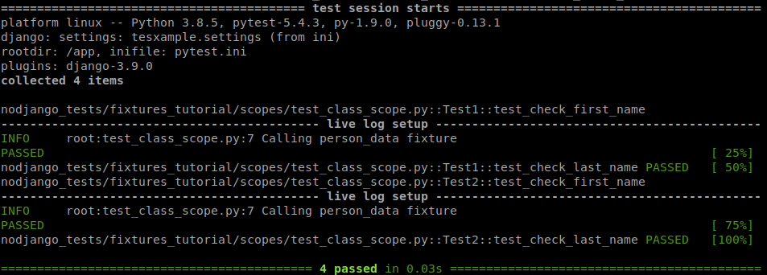

---
title: Tutorial de Fixtures y Scopes
author: Mariano Bianchi
date: 02/10/2020
...

# Pytest fixtures tutorial


## Scopes
Un fixture crea un contexto de test que satisface las precondiciones que un test
puede tener.

Pytest maneja los fixtures como inyección de dependencias, haciéndolos fáciles
de usar y mantener.

En ocasiones los fixtures pueden ser lentos (por ejemplo: abrir un archivo, crear
una conexión smtp, etc) por lo que pytest tiene *scopes* que permiten reutilizar
fixtures a través de varios tests. Los scopes disponibles son:

- function (default)
- class
- module
- package
- session

### Ejemplos

En la carpeta scopes hay 3 archivos. El archivo *test_class_scopes.py* tiene el siguiente 
fixture con scope *class*. 

```python
@pytest.fixture(scope='class')
def person_data():
    logging.info('Calling person_data fixture')
    return {'first_name': 'Juan', 'last_name': 'Lee'}
```
En el fixture hay un logging para ver en consola cuantas veces se llama al fixture. Parados en /app/src/ dentro del container, si corren:
```bash
pytest nodjango_tests/fixtures_tutorial/scopes/test_class_scope.py
```
como se ve en la imagen, van a notar que en consola aparece *Calling person_data fixture* 2 veces, aunque
si revisan el código el fixture se usa en 4 tests. Pero como el *scope* elegido
para el fixture es *class*, el fixture corre una vez por cada clase.



Si leen el log con atención, verán que primero aparece el log que indica que se
va a correr el test *test_check_first_name* de la clase Test1, inmediatamente abajo
aparece el log del fixture. Luego, aparece el log que indica que se está corriendo
el test *test_check_last_name* de la clase Test1 (sin aparecer el log del fixture). Después se repite el mismo patrón
pero con los tests de la clase Test2. Claramente el fixture se esta llamando una sola vez por clase. A continuación pueden ver el codigo completo para estos tests.

```python
class Test1:
    def test_check_first_name(self, person_data):
        assert person_data.get('first_name') == 'Juan'

    def test_check_last_name(self, person_data):
        assert person_data.get('last_name') == 'Lee'


class Test2:
    def test_check_first_name(self, person_data):
        assert person_data.get('first_name') == 'Juan'

    def test_check_last_name(self, person_data):
        assert person_data.get('last_name') == 'Lee'
```

Pueden chequear como funciona el resto de los scopes corriendo los módulos:
* *test_function_scope* : este archivo tiene la clase Test1 mostrada en el código de arriba, pero el fixture visto antes, esta declarado con scope a nivel función, consecuentemente el log del fixture se repite dos veces, aunque las funciones esten dentro de la misma clase.
* *test_module_scope* : este archivos tiene las dos clases del codigo de arriba y además dos funciones sueltas que utilizan el fixture, pero como el scope del mismo en este caso es a nivel módulo el log del fixture solo se va ver una vez.

## Shared
Hay situaciones en las que es útil o necesario poder compartir fixtures entre
distintos módulos (archivos .py) o paquetes (carpetas con archivos .py adentro).
Para que esto sea posible debemos crear un archivo llamado *conftest.py* y
situarlo en la carpeta más cercana en el árbol de carpetas que tengan en común
esos 2 o más módulos o paquetes que van a utilizar el fixture.
Luego se define el fixture dentro de ese archivo, de la misma manera que lo hicimos
hasta ahora.

### Ejemplos
Dentro de la carpeta shared hay un archivo conftest con el fixture que usan los
tests que hay definidos. Además, en el archivo llamado *test_three.py* pisamos
el nombre del fixture y lo redefinimos con otros valores. Pueden correr los tests
con:
```bash
pytest nodjango_tests/fixtures_tutorial/shared/
```
Verán que los tests en *test_one.py*
y *test_two.py* usan el fixture definido en conftest (con scope package) pero que
*test_three.py* usa el fixture redefinido. Esto es por cómo pytest resuelve los
fixtures. Tengan cuidado si usan fixtures con nombres muy genéricos porque puede
pasarles que terminen pisando un fixture existente.

### Recursos

* https://docs.pytest.org/en/stable/fixture.html
