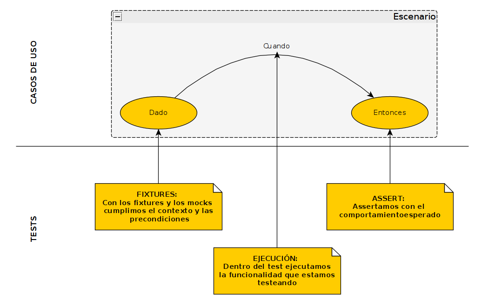

---
title: Tutorial de Pytest
author: Andres Ramirez Miori
date: 15/09/2020
...


# Tutorial Pytest (PyconAr 2020)

## Propósito
El siguiente tutorial esta basado en la charla dada en la [PyconAr2020](http://ponerlink.com). 
El propósito de la misma es hablar un poco de las problemáticas a la hora de hacer test, otro poco sobre la gama de cosas que uno puede llegar a encontrarse al iniciar la práctica de testear y mostrar a partir de un ejemplo sencillo algunas de las herramientas disponibles. En este documento
mostaremos directamente la parte práctica de la charla. No aesguramos que este documento sea autocontenido y en cualquier caso es recomendable mirar la charla.

## Testeando
Bueno como en cualquier lenguaje nuevo que aprendemos escribimos un *hola mundo*, para aprender a testar también podemos hacer algo parecido. Iniciemos con una función sin demasiada utlidad y luego pasemos a testearla.

```python
# nodjango_tests/pyconar2020_tutorial/prices.py

from nodjango_tests.pyconar2020_tutorial.services import get_prices_list


def get_first_value(sort_function, values):
    """Retorna el primer valor de una lista luego de
    ordenarla con la función de orden pasada
    """
    ordered = sort_function(values)
    return ordered[0]


def get_min_price():
    """Retorna el mínimo precio de una lista de precios obtenida desde
    un servicio
    """
    prices = get_prices_list()
    min_price = get_first_value(sorted, prices)
    return min_price

```
La función principal es ```get_min_price```, esta obtiene desde un servicio una lista de enteros, que para nosotros representan precios, luego
llama a la función ```get_first_value``` y retorna el valor devuelto como 
el mínimo precio.

Iniciemos testeando la función ```get_first_value``` que es utilizada por la función principal. Claramente uno no puede siempre testear todo, y en general tampoco es la idea, pero según nuestro entender por cada funcionalidad que uno escribe, idelamente debería pensar en testear las siguientes tres premisas:

* Funcionalidad: la función calcula lo que espero, para esto definimos algún/os casos normales muy específicos y los chequeamos (evitar replicar lógica de la función dentro del test).
* Comportamiento: como no modelamos lo que se supone que no debe suceder hay casos en los que mi función debe retornar una excepción y es bueno saber que nuestra función falle cuando tiene que fallar.
* Utilidad: nuetra función es llamada cuando se necesita. Lo normal es que las funciones que escribimos sean llamadas desde algún otro lugar, y eso es parte de la lógica del dominio que también podemos testear.

pasemos ahora si a los test escritos

```python
# nodjango_tests/pyconar2020_tutorial/tests/test_prices.py
import pytest
from nodjango_tests.pyconar2020_tutorial.prices import get_first_value


def test_get_first_value_returns_min():
    prices_list = [8, 3, 5, 7, 6]
    assert 3 == get_first_value(sorted, prices_list)


def test_get_first_value_except_on_empty_list():
    prices_list = []
    with pytest.raises(IndexError):
        get_first_value(sorted, prices_list)

```
Es fácil notar que el primer test ```test_get_first_value_returns_min``` esta verificando la funcionalidad para un caso muy especifico, y el siguiente test 
```test_get_first_value_except_on_empty_list```, verifica que la función falla
cuando uno espera. O sea no se debería llamar a una función que retorna el primer elemento de una lista, con un lista vacia. Notar que en este caso estamos haciendo abuso de la función ```sorted```, pero nuestra función ```get_first_value``` podría ser llamada con cualquier lista y con cualquier función de orden, particularmente nosotros lo estamos usando de una forma muy rara para obtener el mínimo valor de una lista, por ejemplo el próximo test fallaría

```python
def test_get_first_value_fails():
    prices_list = ['100', '90', '400']
    assert '90' == get_first_value(sorted, prices_list)
```
no por que get_first_value este mal, sino por la forma en que la utilizamos (recordemos que la funcionalidad no es retornar el mínimo valor, sino tan solo el primer elemento luego de aplicar la función de orden), en cambio si hicieramos la misma llamada cambiando la función de orden como se muestra a continuación el mismo test estaría pasando.

```python
def test_get_first_value_returns_min_on_string_numbers():
    def sort_string_numbers(string_numbers):
        return sorted(string_numbers, key=lambda x: int(x))

    prices_list = ['100', '90', '400']
    assert '90' == get_first_value(sort_string_numbers, prices_list)
```
Lo único que nosotro deberiamos poder asegurar de la función de orden es que nos retorna la lista de elementos en otro orden, y como no es una función nuestra, tampoco deberiamos testearla. Aca es donde aparece la necesidad de Mock.

### Mock y MagicMock

```python
from unittest.mock import Mock


def test_get_first_value_returns_ordered_first():
    prices_list = [8, 3, 5, 7, 6]
    mock_sort_function = Mock(return_value=[3, 5, 6, 7, 8])
    assert 3 == get_first_value(mock_sort_function, prices_list)
```

Uno podría plantearse para que usamos la clase Mock o MagicMock si directamente podemos hacer algo de la siguiente pinta:

```python
def test_get_first_value_returns_ordered_first():
    prices_list = [8, 3, 5, 7, 6]
    assert 3 == get_first_value(lambda :[3, 5, 6, 7, 8], prices_list)
```
Es verdad que en este caso con ```lambda``` podemos representar un buen mock de la función de orden, pero la librería mock nos provee un montón de herramientas más, muchas de las cuales sirven para ayudarnos a mockear objetos y funciones mas complicados y otras para testear como son usados esos objectos y funciones que mockeamos. En el siguiente ejemplo podemos ver como a partir del mismo mock, en nuestro test podemos corroborar que la función de orden es llamada, y que es llamada con los parámetros que esperamos.

```python
def test_get_first_value_returns_ordered_first():
    prices_list = [8, 3, 5, 7, 6]
    mock_sort_function = Mock(return_value=[3, 5, 6, 7, 8])
    assert 3 == get_first_value(mock_sort_function, prices_list)
    assert mock_sort_function.call_count == 1
    # verificamos que se llama a la funcion de orden con la lista incial
    mock_sort_function.assert_called_with(prices_list)
```

Otros ejemplos de funciones que nos provee mock son:
* assert_called: chequea que fue llamado.
* assert_called_once: chequea que fue llamado solo una vez.
* assert_called_once_with: chequea que fue llamado solo una vez y con los parámetros especificados.
* assert_called_with: chequea que fue llamado con los parámetros especificados
* assert_has_calls: chequea llamados desde una lista de llamados
* assert_not_called: chequea que no se llama
* etc

En todos los ejemplos anteriores podriamos haber usado MagicMock en lugar de Mock, la gran diferencia entre estas dos clases es que MagicMock tiene implementaciones por defecto de los magic methods. Luego el uso debería ser por necesidad y criterio de cada uno.

Ahora estaría faltando la última premisa, que es ver que nuestra función es usada donde corresponde, para algo la escribimos. Volvamos la función desde la cual usamos ```get_first_value```

```python
def get_min_price():
    """Retorna el mínimo precio de una lista de precios obtenida desde
    un servicio
    """
    prices = get_prices_list()
    min_price = get_first_value(sorted, prices)
    return min_price
```

Si recordamos, en el último test que hicimos de ```get_first_value```, pudimos mockear la función ```sorted```, verificar que se usaba, y como se usaba dentro de nuestra función muy fácilmente. Esta facilidad radica en que ```get_first_value``` recibe la función de ordenamiento como parámetro. Luego sencillamente pasamos nuestro mock como parámetro y listo. Pero en el caso de la función ```get_min_price```, no recibe ningún parametro y hace uso de nuesra funcion ```get_first_value``` (que ya testeamos y ahora queremos testear que es llamada dentro de esta función), como también hace uso de un servicio que nos retorna una lista de precios, el cual no nos corresponde testear y deberiamos mockearlo también, especialmente siendo un servicio externo sobre el cual no tenemos gobernanza. Pero como hacemos para reemplaza estas funciones en nuestro test por mocks que controlemos. Aca es donde aparece Patch.

### Patch
Patch nos permite remplazar funciones que se usan es ciertos lugares del código por mocks, en general cuando realizamos test casi todo esta en ver como escribir bien los patch y los mokcs, después de todo, lo demás es casi verificar que el llamado a una función da un resultado esperado. Imaginemos que queremos verificar que ```get_min_price``` nos da el resultado esperado, iniciarimos con un test del tipo:
```python
# nodjango_tests/pyconar2020_tutorial/tests/test_prices.py
from nodjango_tests.pyconar2020_tutorial.prices import get_min_price

def test_get_min_price_returns_min_values():
    assert ??? == get_min_price()
```
Claramente al usar un servicio no determinístico para obtener la lista de precios, cualquier cosa que pongamos para reemplazar **???**, sólo va a funcionar cuando tengamos suerte. También podría pasar que el servicio este caido mientras ejecutemos nuestro test o podriamos llegar a querer testear como se comporta nuestro código cuando el servicio esta caido, etc. Todos estos escenarios podriamos simularlos usando un mock nuestro del serivicio, y este mismo test se deberia escribir de la formar:


```python
# nodjango_tests/pyconar2020_tutorial/tests/test_prices.py
from nodjango_tests.pyconar2020_tutorial.prices import get_min_price
from unittest.mock import patch


def test_get_min_price_returns_min_values():
    prices_list = [8, 3, 5, 7, 6]
    with patch(
        'nodjango_tests.pyconar2020_tutorial.prices.get_prices_list'
    ) as mock_prices:
        mock_prices.return_value = prices_list
        assert 3 == get_min_price()
```
o
```python
# nodjango_tests/pyconar2020_tutorial/tests/test_prices.py
from nodjango_tests.pyconar2020_tutorial.prices import get_min_price
from unittest.mock import patch


@patch('nodjango_tests.pyconar2020_tutorial.prices.get_prices_list')
def test_get_min_price_returns_min_values(mock_prices):
    prices_list = [8, 3, 5, 7, 6]
    mock_prices.return_value = prices_list
    assert 3 == get_min_price()
```
Notar que la ruta del patch deber ser al lugar donde se usa la función que se quiere mockear y no al lugar donde esta esté definida. Luego con este test verificamos que si el servicio retorna esa lista especifica, nuestra función retorna el mínimo valor que es 3, lo cual ya sabiamos por que anteriormente habiamos corroborado que ```get_first_value``` retornaba 3 con esta misma lista. Lo que en verdad queriamos ver ahora es que nuestra función ```get_min_price```, usa la función ```get_first_value``` y retorna lo mismo que responde esa función que ya testeamos anteriormente.

```python
# nodjango_tests/pyconar2020_tutorial/tests/test_prices.py
from nodjango_tests.pyconar2020_tutorial.prices import get_min_price
from unittest.mock import patch


@patch('nodjango_tests.pyconar2020_tutorial.prices.get_first_value')
@patch('nodjango_tests.pyconar2020_tutorial.prices.get_prices_list')
def test_get_min_price_use_get_first_value(mock_g_prices, mock_g_first):
    prices_list = [8, 3, 5, 7, 6]
    mock_g_prices.return_value = prices_list
    mock_g_first.return_value = 4  # 😁
    assert 4 == get_min_price()
    mock_g_first.assert_called_once_with(sorted, prices_list)
```

### Fixtures
Bueno, último tema para este pseudo tutorial inicial, que ya son bastantes temas. Es raro (o no el común de los casos), que nuestras funciones estén completamnete aisladas, las mismas suelen ejecutarse dentro del contexto de algún aplicativo, el que puede hacer uso de muchas cosas como variables de entorno, bases de datos, usuario, servicios, etc. Los fixtures son una fomra de construir estos contextos para nuestros tests, siguiendo el ejemplo de tests mostrado hasta ahora, es fácil ver que en casi todos los tests usamos la siguiente linea para mockear la repuesta del servicio de precios
```python
prices_list = [8, 3, 5, 7, 6]
```
en este caso es una sencilla lista pero los servicios que consumimos puden retornar objetos mucho mas complejos, diccionarios que representes personas con datos de domicilio, contacto, ..., lista de articulos, etc. Y entre que no queremos duplicar esa porción de código en cada test que escribimos, también podemos querer que nuestros test se ejecuten todos con los mismos casos, etc. Los fixures para los test se suelen escribir en un archivos nombrado **conftest.py** dentro del directorio tests, y se usa el decorator fixture que nos provee pytest como se muestra a continuación:

```python
# nodjango_tests/pyconar2020_tutorial/tests/conftest.py
import pytest


@pytest.fixture
def prices_list():
    return [8, 3, 5, 7, 6]
```
En el [tutorial de fixtures](../fixtures_tutorial/README.md) puden ver como es que pytest hace lo que se llama el **"fixture discovery"**. Luego para hacer el uso del fixture sencillamente lo usamos en la función de test por su nombre, como si fuese un parámetro. En el primer test que hicimos cambiaria así

```python
# Sin usar fixture
def test_get_first_value_returns_min():
    prices_list = [8, 3, 5, 7, 6]
    assert 3 == get_first_value(sorted, prices_list)

# Usando fixture
def test_get_first_value_returns_min(prices_list):
    assert 3 == get_first_value(sorted, prices_list)
```
el mismo remplazo se puede realizar en todos los test donde usabamos esa lista y en todos esos lugares los valore de esa lista van a ser los definidos en el fixture. Otro uso muy común para los fixtures, es tener por ejemplo un usuario del sistema o la definición de algunas variables de entorno que nuestro aplicativo utilice. Ya sea por que necesitmos que esten definidas a la hora de correr los test y nada nos asegura esto, o por que queremos que tengan un valor especifico mientras corremos los tests. Pytest nos provee con un fixture especial y muy útil llamado **monkeypatch** este fixture nos da muchas funcionalidades para patchear y mockear diferentes objetos, variables, etc. En el siguiente ejemplo creamos un fixture que nos asegura, que en los tests donde lo usemos, la varibale de entorno **USER**, va a tener el valor **TestingUser**, y una vez que el test termine de correrse esa misma varibale va a quedar en su estado original. Se puede ver que un fixture se puede usar como parámetro de otro fixture, como se hace a continuación con monkeypatch. 


```python
@pytest.fixture
def env_user(monkeypatch):
    monkeypatch.setenv("USER", "TestingUser")

def test_some_conection(mock_env_user):
    # something here that use 
    assert "TestingUser" == os.getenv("USER")
```
### BDD
Desarrollo orientado por el comportamiento. Para los que les gusta estos temas de ingenieria del software, una de las forma de escribir los casos de uso en BDD es usar los llamados "criterios de aceptación", estos indican que un caso de uso se debe escribir siguiendo la estructura:
* Dado (Given): nos econtramos en el algún instante de mi app.
* Cuando (When): se realiza una acción.
* Entonces (Then): sucede lo que espero de la funcionalidad.

Ejemplificando, con el típico ejemplo de la lista de tareas, un requerimiento podria ser que se desea poder mantener una lista de tareas actualizada, y uno de los casos de uso correspondientes a este requerimiento es que debo poder agregar una tarea a una lista de tareas existente. Si lo escribimos como definimos anteriormente.

* Dado: que se cuenta con una lista de tareas ya iniciada.
* Cuando: se ejecuta agregar una tarea en la lista con un texto que la describe.
* Entonces: se obtiene la lista de tareas con la el texto agregado como nueva tarea.

Con la siguiente imagen se puede ver como reflejar exactamente el caso de uso con lo que correspondería a realizar un test del mismo.




## Recursos

* [Pytest](https://docs.pytest.org/en/stable/): Pagina oficial de Pytest
* [MonkeyPatch](https://docs.pytest.org/en/stable/monkeypatch.html): De la página oficial de pytest la sección correspondiente a monkeypatch.
* [Fixtures](../fixtures_tutorial/README.md): Tutorial de fixtures y scopes de este repo escrito por Mariano Bianchi

